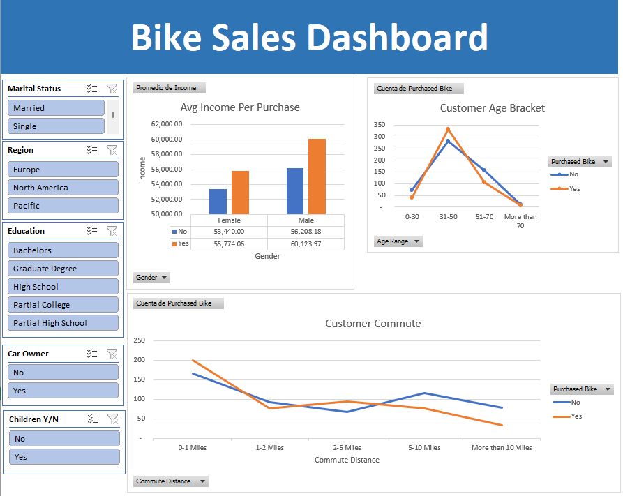

<!-- PROJECT LOGO -->
 

  

<h1 align="center">Bycicle Excel Dashboard</h1>

  

    This is a visualization Project using a small database of bike ownership. Excel is used to clean, analyze and create an interactive dashboard.
     
    <a href="https://github.com/Daltonag1/Tech_Survey_Dashboard"><strong>Explore the docs »</strong></a>

  

<!-- ABOUT THE PROJECT -->
## About The Project
 

 

In this Project, you will find a simple dashboard analyzing bike sales consulting 1000 people. To understand if they did o didn't buy a bike, information such as income, occupation, age, commute to work, etc. was gathered. 

(<a href="#readme-top">back to top</a>)

## Built With

(<a href="#readme-top">back to top</a>)

<!-- GETTING STARTED -->
## Data Transformation / Cleaning
#### All data transformation and cleaning was made within the Excel file as follows:

- Checked and removed duplicates. 26 duplicates were found when looking at the person's unique ID.

- Marital status was changed from "S" and "M" to "Married" and "Single using find and replace.

- 3 new columns were created. "Children Y/N" using an IF function from "Children", "Car Owner" using an IF function from "Cars" and "Age Range" using an IF function from "Age"

- Column "Average Salary" was created using Q3 column, were people selected their salary based on a range.

- Pivot tables created for the Dashboard creation.

(<a href="#readme-top">back to top</a>)

## Dashboard Creation
#### The following metrics are the ones being analyzed. Needless to say, there's much more metrics that we can analyze, but we can have a pretty good overview of what the survey has to offer:

- Customer Age.

- Average Income.

- Custommer Commute.

##### Slicers were created to further analyze metrics:

- Marital Status.

- Region.

- Education.

- Car Owner.

- Children Y/N.

(<a href="#readme-top">back to top</a>)

## Conclusions Made From Metrics
#### Looking at the Dashboard, here's some of the conclusions we can get:

- People who bought bikes, have a higher income than the ones who didn't.

- People who have children tend to buy bikes. This trend increases if they are married.

- People who don't have cars buy bikes.

- The lower the commute, the higher the chances of buying a bike. People who own cars and don't have a bike increases rapidly when the commute is 5+ miles.

- People who don't own cars or bikes are almost null in a commute of 5+ miles. This may indicate people with remote jobs or company-offered transport due to long distances.

- Analyzing European region specifically, almost the entire commutes are less than 2 miles. We find a higher rate of bought bikes, but both trends decrease rapidly after 2+ miles. This may indicate that Europeans tend to use public transport. It may also be related to the lower AVG. Income (40k vs 60k from other regions).

- The majority of the people are between 31-50 years. In this range, there are more people bith bikes. This may relate to people having young children and being married. We can see a downturn on the trend when people are between 51-70, where we have more people who don't own bikes than the ones who do, indicating that at an elderly age they prefer to drive cars.

(<a href="#readme-top">back to top</a>)

<!-- CONTRIBUTING -->
## Contributing

Contributions are what make the open source community such an amazing place to learn, inspire, and create. Any contributions you make are **greatly appreciated**.

If you have a suggestion that would make this better, please fork the repo and create a pull request. You can also simply open an issue with the tag "enhancement".
Don't forget to give the project a star! Thanks again!

1. Fork the Project
2. Create your Feature Branch (`git checkout -b feature/AmazingFeature`)
3. Commit your Changes (`git commit -m 'Add some AmazingFeature'`)
4. Push to the Branch (`git push origin feature/AmazingFeature`)
5. Open a Pull Request

(<a href="#readme-top">back to top</a>)

<!-- CONTACT -->
## Contact

Agustin Dalton - agustindalton@gmail.com

Project Link: [https://github.com/Daltonag1/Tech_Survey_Dashboard](https://github.com/Daltonag1/Tech_Survey_Dashboard)

(<a href="#readme-top">back to top</a>)

